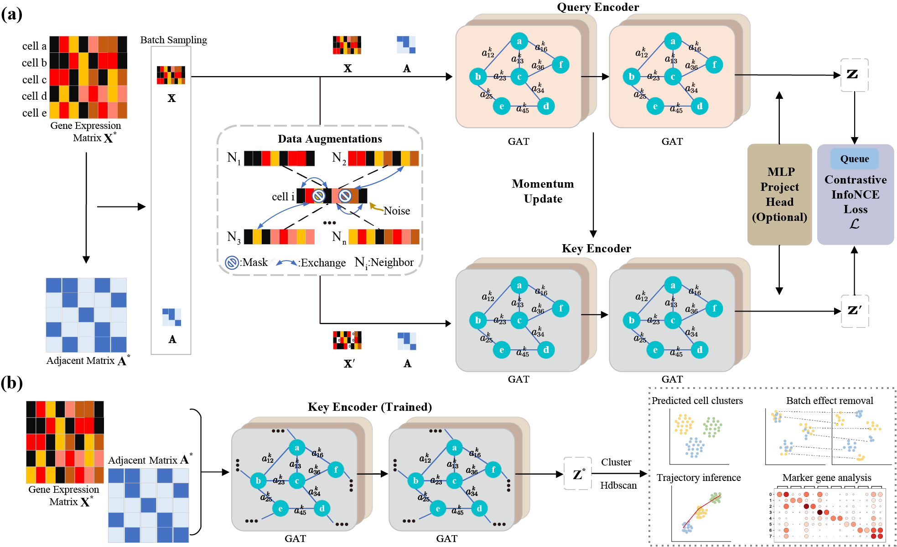

# scGCC: Graph Contrastive Clustering with Neighborhood Augmentations for scRNA-seq Data Analysis



## Introduction

In this study, we propose **scGCC**, a novel graph self-supervised contrastive learning model, to address the challenges faced in RNA-seq data analysis. scGCC comprises two main components: a representation learning module and a clustering module. The scRNA-seq data is first fed into a representation learning module for training, which is then used for data classification through
a clustering module. scGCC can learn low-dimensional denoised embeddings, which is advantageous for our clustering task. We introduce Graph Attention Networks (GAT) for cell representation learning, which enables better feature extraction and improved clustering accuracy. Additionally, we propose five data augmentation methods to improve clustering performance by increasing data diversity and reducing overfitting. These methods enhance the robustness of clustering results.

## Installation

The package can be installed by `git`. The testing setup involves a Windows operating system with 16GB of RAM, powered by an NVIDIA GeForce GTX 1050 Ti GPU and an Intel(R) Core(TM) i7-7700HQ CPU @ 2.80GHz, running at a clock speed of 2.80 GHz.

### 1. Git clone from github

```
git clone https://github.com/tswstart/scGCC.git
cd ./scGCC/
```

### 2. Utilize a virtual environment using Anaconda

You can set up the primary environment for scGCC by using the following command:

```
conda env create -f environment.yml
conda activate scGCC
```

## Running scGCC

### 1. Data Preprocessing

For those who require swift data preparation, we offer a convenient Python script named preprocess_data.py located within the preprocess directory. This script, built on the foundation of Scanpy, streamlines the process of format transformation and preprocessing. It supports three types of input file formats: **H5AD, H5, and CSV data**. Throughout the preprocessing procedure, there are a total of five operations, encompassing cell-gene filtering, normalization, logarithmic transformation, scaling, and the selection of highly variable genes.

```python
# H5AD files
python preprocess/preprocess_data.py --input_h5ad_path=Path_to_input --save_h5ad_dir=Path_to_save --filter --norm --log --scale --select_hvg
# H5 files
python preprocess/preprocess_data.py --input_h5_path=Path_to_input --save_h5ad_dir=Path_to_save --filter --norm --log --scale --select_hvg
# CSV files
python preprocess/preprocess_data.py --count_csv_path=Path_to_input --label_csv_path=Path_to_input --save_h5ad_dir=Path_to_save --filter --norm --log --scale --select_hvg
```

### 2. Apply scGCC

By utilizing the preprocessed input data, you have the option to invoke the subsequent script for executing the scGCC method:

```python
python scGCC.py --input_h5ad_path="data_name.h5ad" --epochs 100 --lr 1 --batch_size 512 --low_dim 256 --aug_prob 0.5 
```

In this context, we offer a collection of commonly employed scGCC parameters for your reference. For additional details, you can execute `python scGCC.py -h`.

**Note**: output files are saved in ./result, including `embeddings (feature_scGCC_data_name.csv)`, `ground truth labels (gt_label_scGCC_data_name)`, `cluster results (pd_label_scGCC_data_name)`, `KNN graph` and some `log files (log_scGCC_data_name)`.

## Running example

### 1. Collect Dataset.

Our sample dataset is stored in the directory "data/original/yang.h5".

### 2. Generate Preprocessed H5AD File.

```python
python preprocess/preprocess_data.py --input_h5_path="./data/original/yan.h5" --save_h5ad_dir="./data/preprocessed/" --filter --norm --log --scale --select_hvg
```

### 3. Apply scGCC

```python
python scGCC.py --input_h5ad_path="data/preprocessed/yan_preprocessed.h5ad" --epochs 100 --lr 1 -- atch_size 512 --low_dim 256 --aug_prob 0.5
```

## Citation